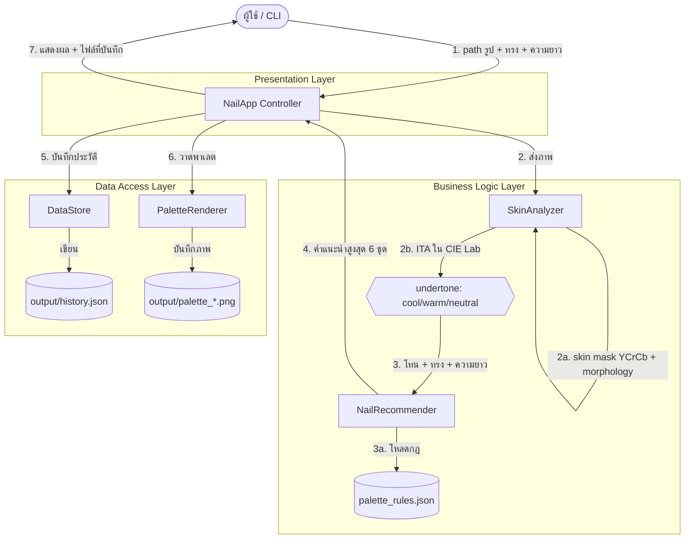

# System Architecture & Workflow Flowchart

แผนภาพการไหลของข้อมูลของ **ระบบแนะนำสีทาเล็บจากโทนผิว (Nail Color Recommender)**
แสดงการทำงานร่วมกันของ Presentation Layer (CLI), Business Logic Layer และ
Data Access Layer ตามหลัก Separation of Concerns



## คำอธิบายลำดับการทำงาน

1. ผู้ใช้ระบุ path รูปมือ พร้อมทรงเล็บและความยาวเล็บ (ผ่าน CLI)
2. `SkinAnalyzer` ตรวจจับบริเวณผิว (YCrCb + morphology + เลือกก้อนใหญ่สุด)
   แล้วประเมินโทนผิวด้วยค่า ITA ใน CIE Lab → cool / warm / neutral
3. `NailRecommender` โหลดกฎจาก `palette_rules.json` แล้วจับคู่โทนผิว + ทรง +
   ความยาว เพื่อสร้างคำแนะนำ (สูงสุด 6 ชุด, ลบรายการซ้ำ)
4. `DataStore` บันทึกผลการวิเคราะห์ลง `output/history.json` (Data Persistence)
5. `PaletteRenderer` วาดแถบสีพาเลตและบันทึกเป็น `output/palette_*.png`
6. `NailApp` แสดงผลทางหน้าจอและบอกตำแหน่งไฟล์ที่บันทึก

> GitHub แสดงผลบล็อก ```mermaid``` เป็นแผนภาพอัตโนมัติเมื่อเปิดไฟล์นี้บนเว็บ
